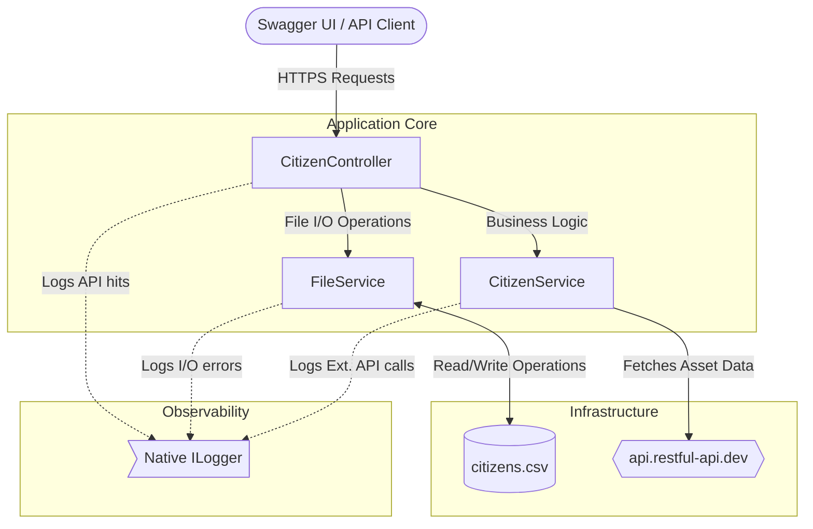

# Citizen Registry API

A .NET Web API developed to manage a city's citizen registry. 

Rather than just focusing on code implementation, this project serves as a practical exercise in modern application architecture. It implements standard CRUD operations, CSV-based data persistence, and external API integration, while strictly adhering to the 12-Factor App methodology and the Git Flow branching model.

---

## How It Works

The API handles citizen records through a simple, automated flow:

* **Dynamic Blood Group:** Assigned randomly the moment a citizen is created.
* **External Asset Integration:** Makes a secure HTTPS request to an external REST API (`https://api.restful-api.dev/objects`) to fetch a list of objects, picks one at random, and assigns it as the citizen's "Personal Asset" during creation.
* **Strict Updates:** To keep data consistent and enforce business logic (CI and Blood Group shouldn't change once registered), updates are locked down strictly to the `FirstName` and `LastName` fields.

---

## Architecture and Flow

The application enforces a clean separation of concerns. The `CitizenController` strictly handles incoming traffic and standard HTTP responses, while the underlying services manage the business logic, external calls, and file I/O operations.



---

## API Endpoints

The API is fully documented and testable via the built-in Swagger UI at `https://localhost:5001/swagger`. The interface allows testing all CRUD operations against the `Citizen` entity, including input validation via specialized DTOs (Data Transfer Objects) seen in the Schemas section (`CreateCitizenDto`, `UpdateCitizenDto`).

| Method | Endpoint | Description |
| :--- | :--- | :--- |
| **POST** | `/api/citizens` | Creates a citizen, assigns a random blood group, and fetches an external asset. |
| **GET** | `/api/citizens` | Grabs all the citizens currently living in the registry. |
| **GET** | `/api/citizens/{ci}` | Finds a specific citizen by their unique CI. Returns 404 if not found. |
| **PUT** | `/api/citizens/{ci}` | Updates an existing citizen (only `FirstName` and `LastName`). Returns 404 if not found. |
| **DELETE** | `/api/citizens/{ci}` | Removes a citizen from the system. Returns 404 if not found. |

---

## Data and External Integration

### The CSV Database

To maintain a stateless application process, data is persisted locally in `citizens.csv`. Every time a record changes (create, update, delete), the app performs file operations to read and overwrite this file using a simple row-based format.

The actual data stored in the file follows this schema and example content:

```csv
FirstName,LastName,CI,BloodGroup,PersonalAsset
Shantal,Espinoza,1234567,O-,Apple iPhone 12 Pro Max
Linus,Trovalds,01010,AB+,Apple iPad Air
```

### The External API

During the creation process, the application acts as a client to `https://api.restful-api.dev/objects`. It performs a secure **HTTPS request** to retrieve available objects. The system selects one randomly (e.g., "Apple iPhone 12 Pro Max") and assigns it to the `PersonalAsset` field of the new citizen before saving. This ensures that the asset data is dynamic and not hardcoded into the system logic.

---

## Git Flow and Commit Standards

This project strictly adheres to the Git Flow branching model to maintain a clean history and safe deployment cycle.

### Main Branches

1.  **`main`**: Contains the clean, production-ready code.
2.  **`develop`**: The primary integration branch where all feature branches merge.
3.  **`P2-001`**: My dedicated practice feature branch where the active development work was performed.

### Commit Standards

Commits are descriptive, atomic, and scoped to the practice branch to clearly document progress. Here are some real examples from the project's history:

```text
P2-001 Implemented complete CRUD operations with logging
P2-001 Integrated external API for Personal Asset assignment
P2-001 Adding file persistence and error logging
P2-001 Add Citizen DTOs for create and update
```

### Ignored Files

To prevent local configuration, user-specific data, and build artifacts from leaking into the shared repository, the `.gitignore` file is configured to exclude folders like `.vs/`, `.vscode/`, `bin/`, and `obj/`.

---

## The 12-Factor App Principles Application

The core objective of this practice was to build an application that is robust, cloud-ready, and scalable by applying modern architecture concepts. Here is how each of the 12 factors was applied to this project:

### 1. Codebase

All development work is tracked within a single Git repository. The use of the three-branch Git Flow structure (`main`, `develop`, `P2-001`) allowed me to isolate active development work from final, deliverable code, ensuring a single codebase tracks all deployments.

### 2. Dependencies

I prioritized explicit declaration and isolation. All project dependencies, including Swashbuckle for Swagger/OpenAPI support, are explicitly declared in the `CitizensWebApi.csproj` file. The application is completely self-contained and does not rely on any pre-installed system packages or implicit global assumptions.

### 3. Config

I completely eliminated hardcoded paths and URLs within the application logic. Configuration values, such as the `FileStorage:Path` and the `ExternalApi:Url`, are managed externally via the `appsettings.json` file. If this application were deployed to a staging or production environment, these values could be easily overridden using environment variables without modifying the source code.

### 4. Backing Services

The external Object API is treated purely as an attached resource. I consume it via an injected `HttpClient` in the service layer, making the connection an attached resource that is easily interchangeable or swappable if the resource URL changes, without impacting the core business logic.

### 5. Build, Release, Run

The standard .NET CLI workflow separates these stages:

* **Build:** Executing `dotnet build` compiles the code and generates artifacts.
* **Release:** The final codebase state in `main` represents the release. Merging branches acts as the checkpoint.
* **Run:** Executing `dotnet run` (or running the final published artifact) starts the Kestrel server totally separate from the build phase.

### 6. Processes

The API executes as a fully stateless process. Memory is not used to share or store citizen data; instead, state is immediately offloaded to a backing persistent file (`citizens.csv`). This ensures that any instance of the application can handle any request at any time.

### 7. Port Binding

To ensure self-containment and avoid dependencies on external web server injections (like IIS) during development, the application securely exposes itself using the Kestrel server. Per the `launchSettings.json`, it binds itself strictly to **`https://localhost:5001`**.

### 8. Concurrency

Because the application is stateless (as defined in Factor 6), scaling the API processes themselves can be achieved conceptually by running multiple instances. *(Note: Relying on a shared CSV file for persistent storage currently bottlenecks real-world horizontal scaling, but the stateless design means swapping this file service for a proper database backing service later would instantly unlock full concurrency.)*

### 9. Disposability

The .NET Kestrel server provides very fast startup times and handles shutdown gracefully. It listens for termination signals (like Ctrl+C in the console) to stop accepting new requests and clean up existing operations, ensuring no corrupted state during shutdown (e.g., mid-write to the CSV).

### 10. Dev/Prod Parity

By utilizing external configurations (`appsettings.json`) and avoiding local-only dependencies, the gap between development and production environments is minimal. The exact same application code and `dotnet` deployment commands apply across all environments.

### 11. Logs

Instead of managing complex log files internally that require rotation or deletion policies, I utilized the native .NET Logging Framework (`ILogger`). Logs are treated as continuous event streams written directly to the standard output (the console). I configured it to flag critical events, such as *"Citizen created,"* *"Citizen updated,"* and *"External API request executed,"* which are ready to be captured by any log aggregation tool.

### 12. Admin Processes

Administrative or management tasks should run as separate, one-off processes. While not strictly required within this scope, tasks such as CSV data schema migrations or periodic data purges would be executed as separate standalone console scripts running against the shared data source, isolated from the live API traffic.

---

## Running the Application

To test the project locally, open your terminal in the project root and execute the following commands:

```bash
dotnet restore
dotnet build
dotnet run
```

Once the application is running, navigate to the local secure HTTPS port configured in the project to interact with the API via the Swagger interface:

**`https://localhost:5001/swagger`**

---

## Final Thoughts

This practice was a great opportunity to connect the dots between writing basic code and designing a solid architecture. Applying the 12-Factor App principles helped me understand the importance of keeping configuration separate, managing state correctly, and thinking about scalability from the very beginning. Combined with Git Flow, the development process felt much more organized and professional. It was a very practical exercise in seeing how modern applications are structured behind the scenes.